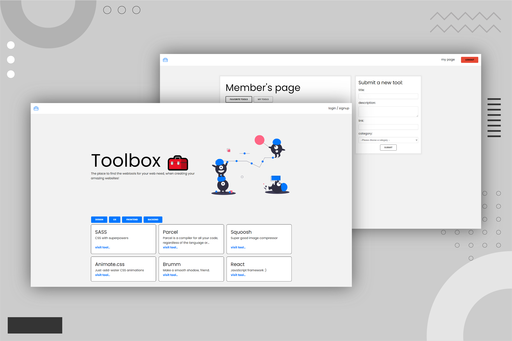
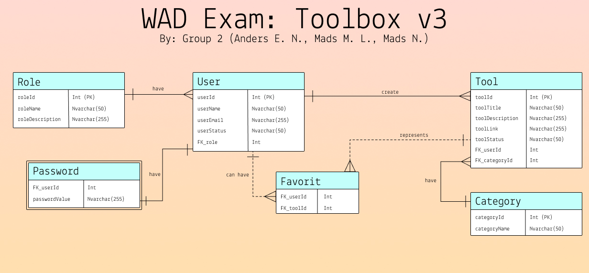

# 🧰 Toolbox



## 👓 Overview

Toolbox is a collection of digital tools used in all aspects of making creating websites. The goal was to have a central hub for collecting the tools that we use when developing, so we could get rid of the haystack that is our browser's bookmarks. The community is the main generator of the content, adding their tools to the toolbox. Toolbox isn't intended to be a one-stop-shop, as none of the tools are hosted here, but as a guidebook to point users in the right direction. 
<br /><br />Toolbox is a full-stack web app that was developed for the Web API Development elective exam at UCN 2021.
<br />We recived the grade: 12(A)

### 🔧 features
- Every tool is categorized in either design, UX, front-end, or back-end.
- User authentication (login & signup)
- Users can add new tools to the toolbox
- Users can favorite tools to their collection
- Users can edit the tools they have submitted
- Admins can edit and delete all tools 
- Light and dark color themes (can be changed by pressing 1)


## 👨‍💻 Custom API

Toolbox is running on a custom API made using SQL, Express, and Node.js.
<br /> Included is a SQL script to set up the database, and populate it with test data 

### 📊 ERD



## ⚙️ Compiling (Front-end)

```bash
🚀 Initialize node 
$ npm i

👨‍💻 Development
$ npm run dev

📯 Distribution
$ npm run build 
```

## ⚙️ Compiling (Back-end)

```bash
🚀 Initialize node 
$ npm i

👨‍💻 Development
$ node index.js
```

## 🚀 Links 

Live Site URL: [Here](https://toolbox-alpha.vercel.app/)
<br />The current version can't connect to the back-end because it's hosted by our school.

## 🎫 License

All parts of Toolbox are free to tinkering under the [open-source MIT license](https://github.com/MLousdal/toolbox/blob/main/LICENSE).